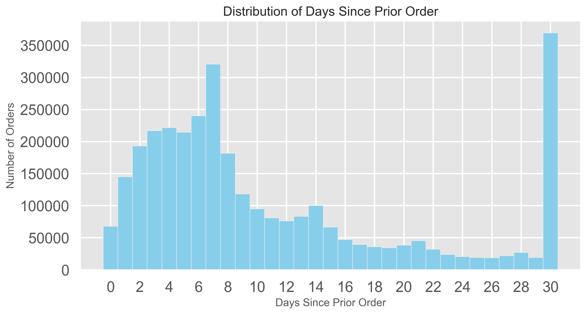
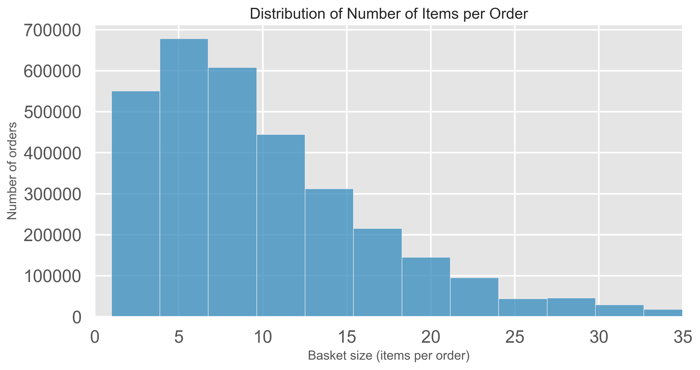
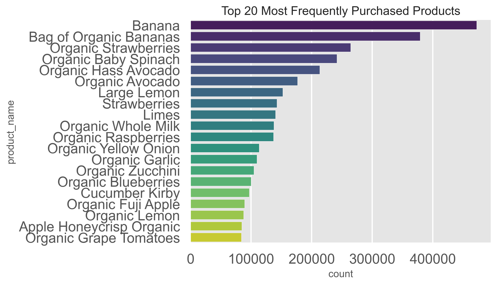
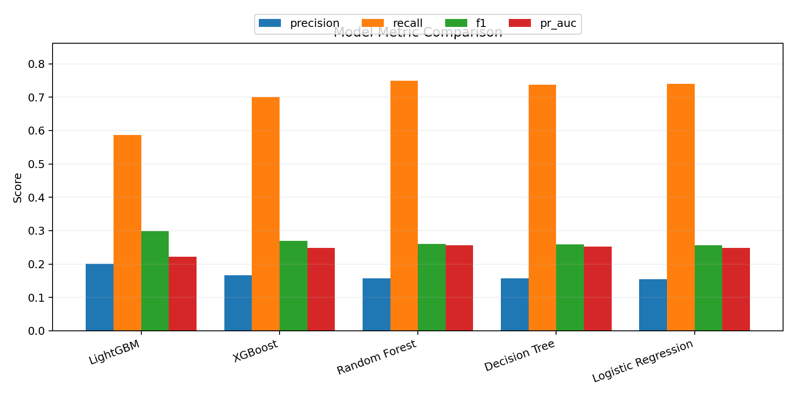
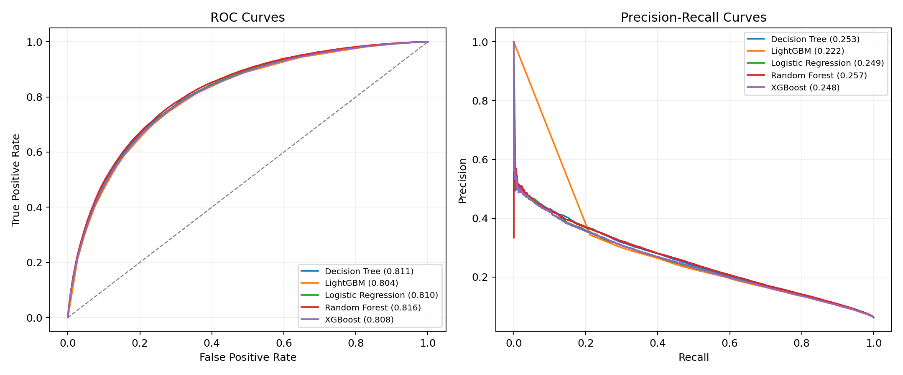
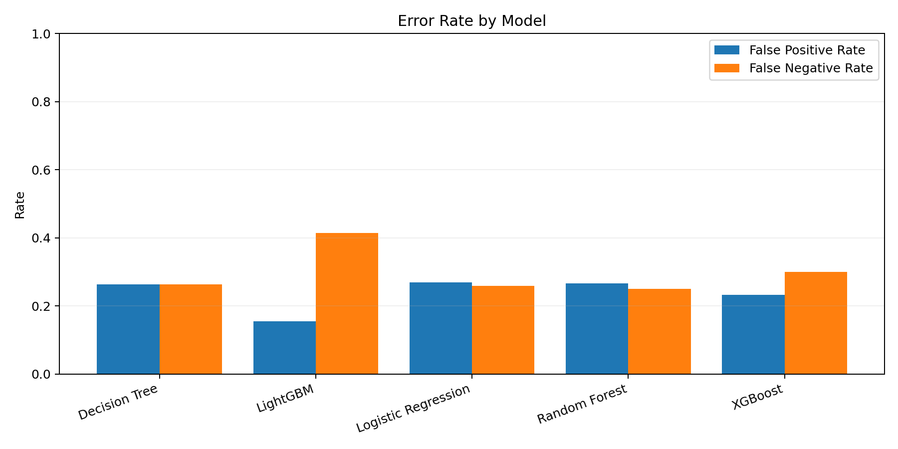
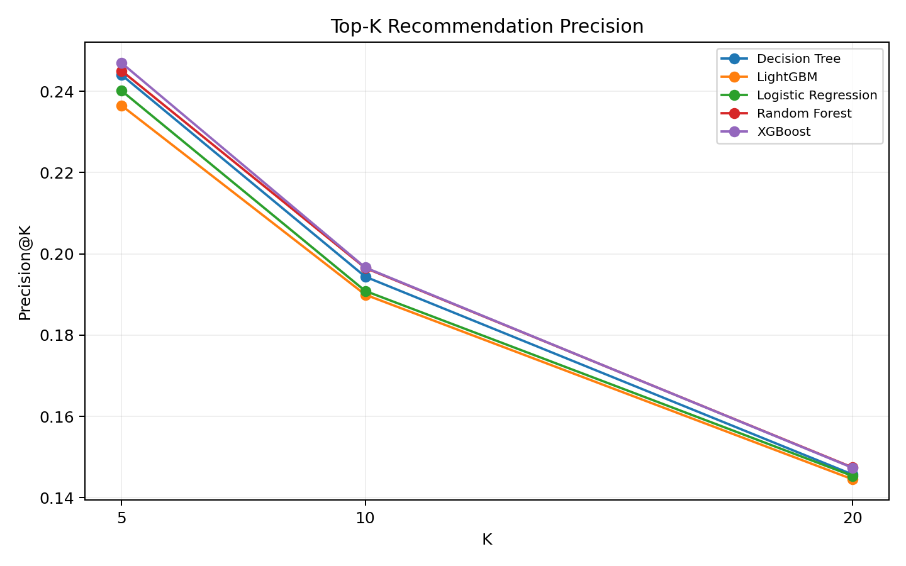
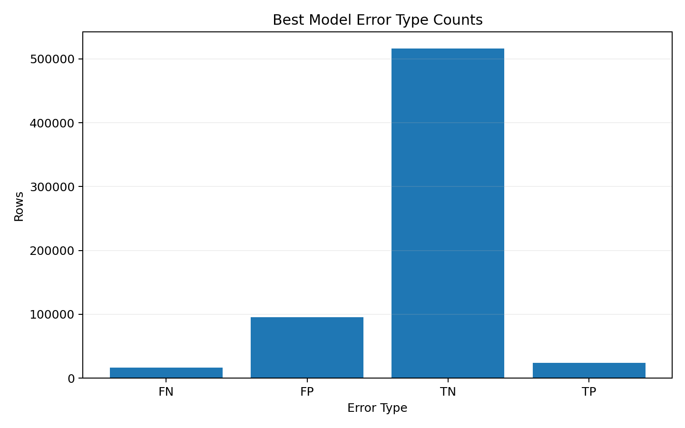
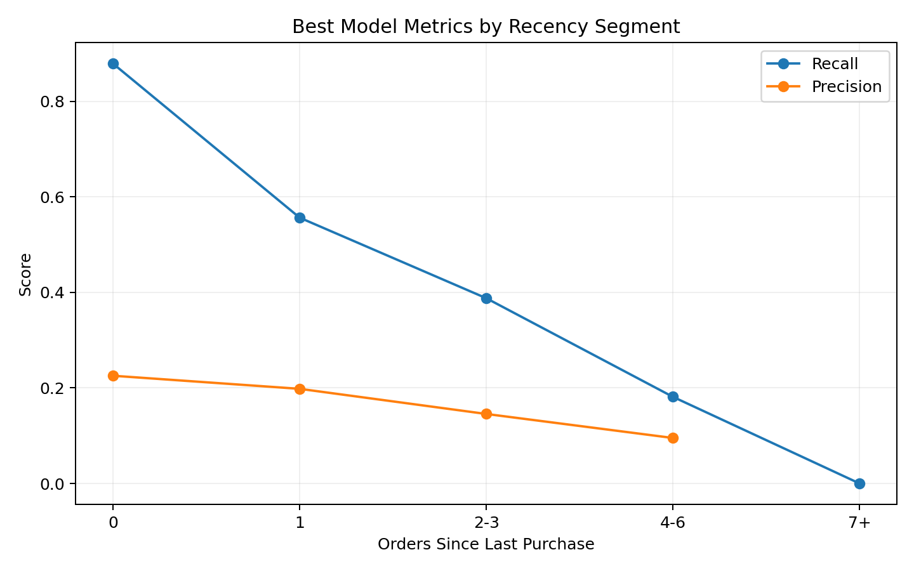

# 数据挖掘课程期末项目报告

## 基于 Instacart 在线零售数据的用户商品复购预测算法对比研究

### 小组成员

| 姓名 | 学号 | 分工方向 |
| --- | --- | --- |
| 王思源 | 2350226 | 数据工程与特征构建 |
| 刘笑云 | 2354269 | 算法建模与实验管理 |
| 曹津硕 | 2353127 | 工程整合与成果交付 |
| 刘宗昊 | 2352845 | 评估分析与可视化 |

---

## 摘要

本项目围绕 Instacart 在线零售场景中的用户商品复购预测任务展开研究。项目以 Kaggle 公开的 Instacart Market Basket Analysis 数据集为基础，构建了用户特征、商品特征、部门特征以及用户-商品交互特征，在统一的用户级数据划分框架下，对 Logistic Regression、Decision Tree、Random Forest、XGBoost 和 LightGBM 五类模型进行系统对比。为了保证实验公平性，所有模型共享同一套特征表、同一训练集/验证集/测试集划分方式，并采用一致的指标体系进行评估。

在 50,000 名采样用户、3,249,449 条候选样本、17 个输入特征的实验设定下，数据呈现明显类别不平衡，正样本比例约为 6.2%。实验结果表明，LightGBM 在测试集上取得最佳 F1 值 0.2986、最高 Accuracy 0.8283 和最低 LogLoss 0.2232，适合作为当前项目中的综合最优模型；Random Forest 在 ROC-AUC 和 PR-AUC 上表现更优，说明其排序能力较强；XGBoost 在 Precision、Recall 和 F1 之间取得了较均衡的表现。进一步的 Top-K 分析、Bootstrap 置信区间和 McNemar 显著性检验表明，集成学习模型整体优于线性与单棵树基线模型，但当前特征空间仍然限制了整体上限。项目最后结合错误分析与切片分析，总结了复购预测的主要影响因素与后续改进方向。

**关键词：** 数据挖掘，复购预测，特征工程，集成学习，LightGBM，Instacart

---

## 1. 研究背景与问题定义

### 1.1 研究背景

在电商和零售业务中，用户是否会再次购买某种商品，直接关系到推荐系统效果、用户运营效率以及库存管理质量。与新用户获取相比，激活已有用户的复购行为通常成本更低、转化更稳定，因此复购预测是一类兼具研究价值和业务价值的典型数据挖掘任务。

Instacart 是美国大型在线生鲜零售平台，其公开数据集记录了用户多次连续下单行为，包含订单顺序、时间信息、商品类别信息以及历史复购标签。与仅包含点击或曝光日志的数据相比，该数据集更适合研究用户长期消费习惯、商品粘性和复购规律。

### 1.2 研究目标

本项目的总体目标是：在统一的数据处理和实验框架下，对多种机器学习方法在用户商品复购预测任务中的表现进行系统比较，并从数据、特征、模型和业务四个层面给出解释。

具体研究目标包括：

1. 构建面向用户-商品对的复购预测数据集与特征体系。
2. 比较不同模型在不平衡分类任务中的性能差异。
3. 分析哪些特征最能反映用户复购倾向。
4. 从推荐业务角度评估模型在 Top-K 推荐场景中的适用性。

### 1.3 研究问题

本项目重点回答以下问题：

1. 不同类型模型在复购预测任务中的综合效果有何差异？
2. 用户行为特征、商品特征与交互特征对预测性能的贡献如何？
3. 在样本极度不平衡的场景下，Boosting 或 Bagging 模型是否优于传统基线模型？
4. 当前模型主要在哪些样本切片上发生误判，后续如何改进？

### 1.4 任务定义

本项目将任务定义为二分类问题。对于某个用户历史上买过的某个商品，判断其是否会出现在该用户下一次订单中。

- 标签 `1`：用户下一单再次购买该商品。
- 标签 `0`：用户下一单没有购买该商品。

需要强调的是，项目标签不是直接使用原始数据中的 `reordered` 字段，而是基于用户历史购买商品集合与其 `train` 订单中的真实商品集合进行匹配后重新构造。这一设计更贴合“预测下一单是否复购”的真实业务目标。

---

## 2. 数据来源与数据理解

### 2.1 数据来源

项目使用 Kaggle 公开数据集 [Instacart Market Basket Analysis](https://www.kaggle.com/datasets/psparks/instacart-market-basket-analysis)。原始数据包括订单表、历史订单商品表、训练订单商品表、商品表、货架表和部门表，共同描述用户在 Instacart 平台上的持续购物行为。

### 2.2 主要数据表

项目使用到的核心表结构如下：

| 数据表 | 主要字段 | 作用 |
| --- | --- | --- |
| `orders.csv` | `order_id`、`user_id`、`eval_set`、`order_number`、`order_dow`、`order_hour_of_day`、`days_since_prior_order` | 描述订单时序与用户下单信息 |
| `order_products__prior.csv` | `order_id`、`product_id`、`add_to_cart_order`、`reordered` | 用户历史订单中的商品明细 |
| `order_products__train.csv` | `order_id`、`product_id`、`add_to_cart_order`、`reordered` | 用户下一单中的真实购买商品 |
| `products.csv` | `product_id`、`product_name`、`aisle_id`、`department_id` | 商品主表 |
| `aisles.csv` | `aisle_id`、`aisle` | 商品细分类别 |
| `departments.csv` | `department_id`、`department` | 商品一级部门 |

### 2.3 实验数据规模

考虑课程项目的计算资源限制，特征工程脚本从全部用户中固定随机采样 50,000 名用户进行实验，随机种子为 42。根据现有训练报告，最终建模数据的基本规模如下：

| 指标 | 数值 |
| --- | ---: |
| 采样用户数 | 50,000 |
| 商品数 | 46,904 |
| 候选样本总数 | 3,249,449 |
| 测试集样本数 | 652,116 |
| 输入特征数 | 17 |
| 正样本比例 | 6.2% |

正样本比例仅约 6.2%，说明这是一个典型的类别不平衡学习问题，因此后续模型训练与评估均围绕这一特征展开。

---

## 3. 探索性数据分析

为了在建模之前理解用户行为和商品规律，项目首先对订单间隔、购物篮大小、商品复购率和高频商品进行了探索性分析。

### 3.1 订单间隔分布

从图中可以看出，用户下单间隔主要集中在较短周期内，其中 7 天附近存在明显峰值，说明周度复购行为较常见；同时在 30 天位置存在非常显著的峰值，表明平台数据中存在大量月度或接近月度周期的重复购买行为。这一现象提示“购买新鲜度”和“周期性”是复购预测中的关键线索。

### 3.2 订单商品数量分布

订单内商品数量整体呈右偏分布，多数订单集中在中小规模购物篮区间，少量订单包含较多商品。这种长尾形态说明不同用户的消费规模差异显著，`user_avg_cart_size` 等用户级统计特征有助于区分轻度购买者与高活跃购买者。

### 3.3 部门复购率差异

从部门复购率对比图可以看到，`dairy eggs`、`beverages`、`produce` 等部门的复购率较高，而 `personal care`、`pantry`、`international` 等部门相对较低。说明生鲜、乳品和饮品等高频消耗型商品更容易形成稳定复购，而部分低频、替代性较强的品类复购难度更高。该结论也支持项目在特征设计中保留 `department_id` 和 `department_reorder_rate`。

### 3.4 高频商品分布

高频商品图显示，香蕉、有机香蕉、有机草莓、有机菠菜、牛油果、柠檬、草莓等商品位列前列，说明平台购买结构高度集中在少数高频生鲜商品上，呈现明显的热门商品长尾分布。这一观察为商品特征中的 `product_total_orders`、`product_unique_users` 和 `product_reorder_rate` 提供了业务解释基础。

### 3.5 EDA 小结

综合探索性分析，可得到以下认识：

1. 用户购买行为具有明显周期性，尤其体现为周度和月度节奏。
2. 商品热度和品类特征差异显著，不同部门的复购属性不同。
3. 用户与商品关系具有明显长尾结构，少数商品高频复购，多数商品则较低频。
4. 复购预测需要同时考虑用户活跃度、商品粘性和用户-商品历史关系，单一维度特征难以覆盖业务复杂性。

---

## 4. 特征工程设计

项目最终构造 17 个输入特征，分为用户特征、商品特征、部门特征和用户-商品交互特征四大类。

### 4.1 用户特征

| 特征名 | 含义 |
| --- | --- |
| `user_total_orders` | 用户历史订单总数 |
| `user_avg_days_between_orders` | 用户平均下单间隔天数 |
| `user_total_products` | 用户历史购买商品总数 |
| `user_avg_cart_size` | 用户平均每单购买商品数 |
| `user_unique_products` | 用户历史购买过的不同商品数 |
| `user_reorder_ratio` | 用户历史复购比例 |

这一类特征主要描述用户的活跃程度、消费规模和复购习惯，是建模用户整体偏好的基础。

### 4.2 商品特征

| 特征名 | 含义 |
| --- | --- |
| `product_total_orders` | 商品被购买总次数 |
| `product_unique_users` | 购买该商品的用户数 |
| `product_reorder_rate` | 商品历史复购率 |
| `product_avg_cart_position` | 商品平均加入购物车顺序 |

商品特征用于反映商品热度、普适性和消费优先级。高复购率商品通常更接近日常刚需，高销量商品更容易被多数用户重复选择。

### 4.3 部门特征

| 特征名 | 含义 |
| --- | --- |
| `department_id` | 商品所属部门 |
| `department_reorder_rate` | 所属部门整体复购率 |

部门特征帮助模型识别“哪类商品天然更适合做复购推荐”，属于较强的先验信息。

### 4.4 用户-商品交互特征

| 特征名 | 含义 |
| --- | --- |
| `up_order_count` | 用户历史购买该商品次数 |
| `up_last_order` | 最近一次购买该商品发生在哪个订单 |
| `up_order_rate` | 该商品在用户历史订单中的出现比例 |
| `up_orders_since_last` | 距离最近一次购买已过去多少单 |
| `up_order_span` | 从首次购买到最近购买经历的订单跨度 |

这部分是整个项目中最核心的特征模块。相比纯用户特征或纯商品特征，交互特征直接描述“这个用户和这个商品之间是否形成稳定关系”。从后续错误分析结果也可验证，`up_order_count`、`up_order_rate` 和 `up_orders_since_last` 对命中与误判具有很强解释力。

### 4.5 标签构造方法

标签构造过程如下：

1. 从 `prior` 订单中提取每个用户历史上买过的商品集合，形成候选用户-商品对。
2. 从 `train` 订单中提取用户下一单真实购买的商品集合。
3. 若某个候选用户-商品对也出现在该用户的 `train` 订单中，则标记为正样本，否则为负样本。

这种构造方式把“下一单是否再次购买”转化为标准二分类任务，同时保证候选集只来自用户真实历史行为，符合推荐业务中的常见召回设定。

---

## 5. 模型设计与实验设置

### 5.1 数据划分

项目采用按 `user_id` 的用户级划分方式，将数据划分为训练集、验证集和测试集，比例为 60% / 20% / 20%。这种方式可以避免同一用户同时出现在训练与测试中，从而减少数据泄露风险，保证评估结果可信。

### 5.2 不平衡问题处理

由于正样本比例仅约 6.2%，项目针对不同模型采取了类别权重策略：

| 模型 | 不平衡处理方式 |
| --- | --- |
| Logistic Regression | `class_weight='balanced'` |
| Decision Tree | `class_weight='balanced'` |
| Random Forest | `class_weight='balanced'` |
| XGBoost | `scale_pos_weight=15.2` |
| LightGBM | `scale_pos_weight=15.2` |

### 5.3 对比模型

| 模型 | 类型 | 说明 |
| --- | --- | --- |
| Logistic Regression | 线性模型 | 作为可解释基线模型 |
| Decision Tree | 单棵树模型 | 作为非线性树模型基线 |
| Random Forest | Bagging 集成 | 关注鲁棒性与排序能力 |
| XGBoost | Boosting 集成 | 强调拟合能力与泛化性能 |
| LightGBM | Boosting 集成 | 强调训练效率与综合表现 |

### 5.4 预处理与调参策略

1. Logistic Regression 使用 `StandardScaler + OneHotEncoder`，对数值特征做标准化，对 `department_id` 做独热编码。
2. Decision Tree 和 Random Forest 直接使用原始数值特征。
3. XGBoost 和 LightGBM 对 `department_id` 使用原生类别处理策略。
4. 模型选择阶段统一在验证集上比较 F1 表现，并以验证集结果确定超参数。
5. LightGBM 在验证集上额外进行了阈值搜索，因此在 F1 上获得了明显优势。

### 5.5 评价指标

项目采用多层次指标体系：

| 指标 | 含义 |
| --- | --- |
| Accuracy | 分类准确率 |
| Precision | 正类预测中真正例的比例 |
| Recall | 实际正类中被召回的比例 |
| F1 | Precision 与 Recall 的调和平均 |
| ROC-AUC | 整体排序能力 |
| PR-AUC | 不平衡数据下对正类排序能力的评估 |
| LogLoss | 概率预测质量 |
| Precision@K / Recall@K | Top-K 推荐场景下的业务指标 |

其中，F1、Recall、PR-AUC 和 Top-K 指标是本项目重点关注的核心指标。

---

## 6. 实验结果与模型对比

### 6.1 测试集总体结果

| 模型 | Accuracy | Precision | Recall | F1 | ROC-AUC | PR-AUC | LogLoss |
| --- | ---: | ---: | ---: | ---: | ---: | ---: | ---: |
| Logistic Regression | 0.7316 | 0.1547 | 0.7405 | 0.2560 | 0.8098 | 0.2485 | 0.5396 |
| Decision Tree | 0.7362 | 0.1566 | 0.7370 | 0.2584 | 0.8110 | 0.2526 | 0.5268 |
| Random Forest | 0.7341 | 0.1574 | 0.7496 | 0.2601 | 0.8160 | 0.2565 | 0.5225 |
| XGBoost | 0.7630 | 0.1667 | 0.7002 | 0.2693 | 0.8079 | 0.2478 | 0.4785 |
| LightGBM | **0.8283** | **0.2003** | 0.5862 | **0.2986** | 0.8043 | 0.2221 | **0.2232** |

按照 F1 排名，模型表现为：

1. LightGBM
2. XGBoost
3. Random Forest
4. Decision Tree
5. Logistic Regression

### 6.2 结果解读

从整体结果看，可以得到以下结论：

1. 五个模型的 ROC-AUC 均在 0.80 左右，说明模型都具备较好的区分能力。
2. 最优 F1 仅为 0.2986，说明任务本身难度较高，当前特征仍是主要瓶颈。
3. LightGBM 在 Accuracy、Precision、F1 和 LogLoss 上表现最好，说明它在当前特征集合下更适合做综合优化。
4. Random Forest 的 Recall、ROC-AUC 和 PR-AUC 更高，说明其在“尽量多找出潜在复购商品”和排序方面更有优势。
5. Logistic Regression 虽然是线性模型，但整体结果并不弱，说明现有特征中存在较强的统计规律。

### 6.3 指标权衡分析

LightGBM 的 Recall 低于其他模型，但 Precision 和 F1 最高，说明其策略更保守，更倾向于在较少推荐中提高命中率。Random Forest 和 Logistic Regression 则表现出更激进的正类预测策略，Recall 较高，但会引入更多误报。对于实际业务而言：

- 如果目标是尽可能覆盖潜在复购商品，应优先考虑 Recall、Recall@K 与 FN 控制。
- 如果目标是减少无效推荐打扰，应优先关注 Precision、F1 与 FP 控制。
- 如果系统需要输出稳定的概率分数用于排序或后续策略模块，LogLoss 和 PR-AUC 更有参考价值。

---

## 7. 可视化评估与统计检验

### 7.1 模型指标对比图

该图直观展示了各模型在 Precision、Recall、F1 和 PR-AUC 上的差异。可以看到 LightGBM 在 F1 与 Precision 上明显领先，而 Random Forest 在 Recall 与 PR-AUC 上具有优势，进一步印证了不同模型在“命中质量”和“覆盖能力”之间的取舍。

### 7.2 ROC 与 PR 曲线

ROC 曲线说明各模型在整体排序层面都明显优于随机分类；PR 曲线更能反映正负样本极不平衡下的正类识别质量。从数值上看，Random Forest 的 PR-AUC 最高，表明其对正类的排序能力更强，而 LightGBM 虽在阈值化后的 F1 最优，但在概率排序层面并非最佳。

### 7.3 错误率对比

结合混淆矩阵结果：

| 模型 | 假阳性率 FPR | 假阴性率 FNR |
| --- | ---: | ---: |
| Logistic Regression | 0.2690 | 0.2595 |
| Decision Tree | 0.2639 | 0.2630 |
| Random Forest | 0.2669 | **0.2504** |
| XGBoost | 0.2328 | 0.2998 |
| LightGBM | **0.1556** | 0.4138 |

可以看出，LightGBM 通过显著降低假阳性率换取了更高的假阴性率，这与其高 Precision、低 Recall 的特征完全一致；Random Forest 则更擅长减少漏判。

### 7.4 Bootstrap 置信区间

项目对 F1、ROC-AUC 和 PR-AUC 进行了 50 轮 Bootstrap 重采样，得到 95% 置信区间。以最佳模型 LightGBM 为例：

| 指标 | 均值 | 95% 置信区间 |
| --- | ---: | ---: |
| F1 | 0.2987 | [0.2919, 0.3057] |
| ROC-AUC | 0.8041 | [0.8008, 0.8098] |
| PR-AUC | 0.2222 | [0.2153, 0.2287] |

置信区间较窄，说明当前测试集规模较大，模型结果具有较好的稳定性。

### 7.5 McNemar 显著性检验

项目对 5 个模型两两配对进行了 McNemar 检验，共得到 10 组比较，结果显示 10 组差异均在 0.05 显著性水平下成立。说明这些模型在同一测试样本上的正确/错误分布差异并非随机波动，而是真实存在的性能差异。

从主要对比结果看：

1. LightGBM 相对 Decision Tree、Logistic Regression、Random Forest 和 XGBoost 均有显著优势。
2. XGBoost 显著优于 Logistic Regression、Decision Tree 和 Random Forest。
3. Random Forest 与基线模型相比也表现出统计意义上的提升。

这说明集成学习模型总体上确实优于传统基线模型，验证了项目的核心研究假设。

---

## 8. Top-K 推荐分析

在推荐业务场景中，系统往往不会直接输出一个二分类标签，而是对商品排序后取每个用户概率最高的前 K 个商品进行推荐。因此，项目进一步计算了 Top-K 指标。

### 8.1 Top-K 结果

| 模型 | K | Precision@K | Recall@K | 用户命中率 |
| --- | ---: | ---: | ---: | ---: |
| XGBoost | 5 | **0.2469** | **0.3015** | 0.5249 |
| Random Forest | 5 | 0.2450 | 0.2992 | 0.5208 |
| Decision Tree | 5 | 0.2440 | 0.2979 | 0.5215 |
| Logistic Regression | 5 | 0.2401 | 0.2932 | 0.5157 |
| LightGBM | 5 | 0.2365 | 0.2887 | 0.5114 |
| XGBoost | 10 | **0.1966** | **0.4714** | 0.5654 |
| Random Forest | 10 | 0.1965 | 0.4712 | **0.5655** |
| Decision Tree | 10 | 0.1944 | 0.4660 | 0.5635 |
| Logistic Regression | 10 | 0.1909 | 0.4576 | 0.5608 |
| LightGBM | 10 | 0.1900 | 0.4554 | 0.5588 |
| Random Forest | 20 | **0.1475** | **0.6711** | **0.5862** |
| XGBoost | 20 | 0.1474 | 0.6708 | 0.5859 |
| Decision Tree | 20 | 0.1457 | 0.6633 | 0.5841 |
| Logistic Regression | 20 | 0.1454 | 0.6616 | 0.5859 |
| LightGBM | 20 | 0.1445 | 0.6579 | 0.5844 |

### 8.2 Top-K 结果解读

Top-K 结果与分类阈值结果并不完全一致。虽然 LightGBM 的 F1 最优，但在排序推荐任务中，XGBoost 与 Random Forest 的 Precision@K、Recall@K 更高。这说明：

1. LightGBM 更擅长在当前阈值下输出“更谨慎的分类决策”。
2. XGBoost 与 Random Forest 更擅长把真正的复购商品排在前列，更适合推荐列表生成。
3. 若项目后续从“分类器”向“推荐器”拓展，排序质量更高的模型可能更有业务价值。

### 8.3 Top-K 曲线

图中可以看出，随着 K 增大，各模型 Precision@K 均逐渐下降，这是推荐覆盖扩大后的正常现象，但 XGBoost 和 Random Forest 在不同 K 值下始终保持领先。

---

## 9. 错误分析与业务解释

### 9.1 最佳模型错误类型分布

以 LightGBM 为例，错误类型分布如下：

| 类型 | 数量 |
| --- | ---: |
| TP | 23,835 |
| FP | 95,133 |
| FN | 16,828 |
| TN | 516,320 |

这表明大部分样本仍为负类，模型主要通过大量 TN 维持较高准确率；与此同时，FN 仍然不可忽视，是未来提升 Recall 的关键方向。

### 9.2 错误类型特征对比

从 `error_type_feature_summary.csv` 可以发现：

1. TP 样本的 `avg_up_order_count=7.52`，显著高于 FN 的 `2.04` 和 TN 的 `1.66`，说明重复购买次数越多，模型越容易成功命中。
2. TP 样本的 `avg_up_order_rate=0.4635`，远高于 FN 的 `0.1509`，说明某商品在用户历史订单中出现比例越高，越有可能被判为复购。
3. TP 样本的 `avg_orders_since_last=0.56`，而 FN 为 `4.96`、TN 为 `11.80`，说明“最近买过”是复购发生的重要先验条件。
4. TP 对应商品的 `avg_product_reorder_rate=0.6550`，高于 FN 的 `0.5640`，说明商品自身粘性也会影响模型判断。

### 9.3 错误切片分析

对关键切片的分析显示：

1. 当 `up_order_count` 从 1 次提升到 `5+` 次时，召回率从 0.1237 提升到 0.9097，说明用户对商品的历史绑定强度几乎决定了复购概率。
2. 当 `up_orders_since_last=0` 时，Recall 达到 0.8791；当该值进入 `7+` 区间时，Recall 降到 0，说明“最近一次购买距今过久”的样本极难被模型判为正类。
3. 商品整体复购率越高，模型 Precision 与 Recall 越好，说明商品级先验确实被模型有效利用。
4. 不同部门之间存在显著差异，例如部门 `7`、`16`、`20` 上的 Recall 相对更高，说明某些品类天然更适合做复购推荐。

### 9.4 业务启示

结合错误分析，可以得到以下业务启示：

1. 用户最近买过且买过很多次的商品，是最值得优先推荐的候选对象。
2. 对“购买间隔已明显拉长”的商品，仅依赖当前静态统计特征难以准确判断，应该引入更细粒度时间衰减特征。
3. 生鲜、乳制品、饮品等高复购部门更适合作为补货提醒和自动推荐的重点场景。
4. 如果业务更关心减少误报，当前 LightGBM 已具备较好基础；如果业务更关心尽量不漏掉潜在复购商品，则需要进一步提升 Recall。

---

## 10. 工程实现与成果交付

### 10.1 项目流程

项目实现了完整的数据挖掘流程：

1. 原始数据读取与多表关联。
2. 特征表构建并输出到 `output/feature_table.csv`。
3. 基于统一数据划分训练五类模型。
4. 输出模型文件、预测文件和指标汇总表。
5. 自动生成评估分析表、图表和文档。
6. 通过 Streamlit 界面完成可视化展示与答辩支持。

### 10.2 主要产出物

| 类别 | 主要文件 |
| --- | --- |
| 特征表 | `output/feature_table.csv` |
| 模型文件 | `output/models/*.pkl`、`output/models/xgboost.json` |
| 预测结果 | `output/predictions/*_pred.csv` |
| 指标汇总 | `output/metrics_summary.csv` |
| 分析结果 | `output/analysis/*.csv` |
| 图表文件 | `figure/*.png`、`figure/evaluation/*.png` |
| 交互展示 | `app.py` |

### 10.3 交互式展示系统

项目基于 Streamlit 提供了界面化展示能力，支持：

1. 查看项目概览和已有产出。
2. 运行特征工程与模型训练脚本。
3. 展示评估分析结果和图表。
4. 进行单条样本预测对比。
5. 浏览报告与可视化结果。

这使项目不仅停留在算法实验层面，也具备一定的工程交付与演示能力。

---

## 11. 团队分工

### 11.1 王思源

负责数据工程与特征构建，包括多表关联、数据清洗、特征设计与特征表生成。

### 11.2 刘笑云

负责模型训练与实验管理，包括五类模型实现、参数调优、训练评估与结果汇总。

### 11.3 曹津硕

负责项目整合与工程交付，包括 Streamlit 展示、README、流程整合与最终交付材料整理。

### 11.4 刘宗昊

负责模型评估与结果分析，包括指标体系设计、图表生成、显著性检验和错误分析。

---

## 12. 不足与改进方向

尽管项目已经完成从数据处理到系统展示的完整流程，但仍存在以下不足：

1. 特征数量相对有限，当前仅使用 17 个输入特征，尚未引入更丰富的时序特征、商品周期性特征和最近 N 单行为特征。
2. 样本存在显著类别不平衡，虽然已经采用类别权重，但 Precision 与 PR-AUC 仍然受到限制。
3. 当前模型主要基于历史买过商品构造候选集，尚未扩展到更大范围的召回与排序一体化推荐流程。
4. 项目未进一步引入 SHAP 等解释工具，特征贡献分析仍以统计现象解读为主。
5. 虽然已有可视化系统，但仍可以进一步完善模型管理、参数记录和在线交互能力。

针对以上不足，后续可从以下方向继续改进：

1. 增加时间衰减特征、周期性特征、最近行为窗口特征。
2. 尝试采样、Focal Loss、阈值自适应等不平衡学习方法。
3. 引入 CatBoost、深度学习序列模型或多模型融合方案。
4. 将当前分类任务进一步拓展为候选召回加精排的两阶段推荐系统。
5. 增强可解释性分析与答辩展示材料的联动。

---

## 13. 结论

本项目基于 Instacart 在线零售数据，完成了一个较完整的用户商品复购预测研究与工程实现。项目通过构建 17 个特征，在统一实验框架下系统比较了五类经典机器学习模型，并通过多指标评估、Top-K 分析、显著性检验和错误切片分析，对结果进行了较深入讨论。

实验表明：

1. 集成学习模型整体优于线性与单树基线模型。
2. LightGBM 在当前设置下取得最佳综合表现，是本项目的推荐主模型。
3. Random Forest 与 XGBoost 在排序推荐场景中更具优势。
4. 用户-商品交互特征，尤其是购买次数、购买比例和最近购买间隔，是影响复购预测的关键因素。

总体来看，本项目不仅验证了多模型对比研究的可行性，也为电商场景中的商品复购预测提供了具有实践意义的分析框架。未来若进一步扩展时序特征与融合模型，项目性能仍有较大提升空间。
